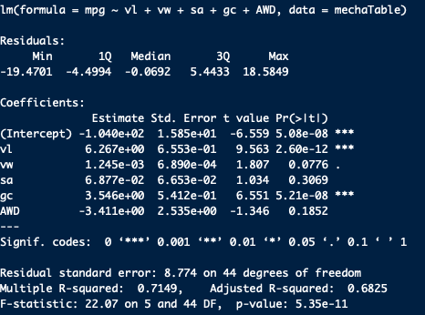
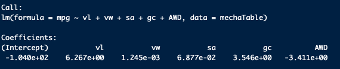
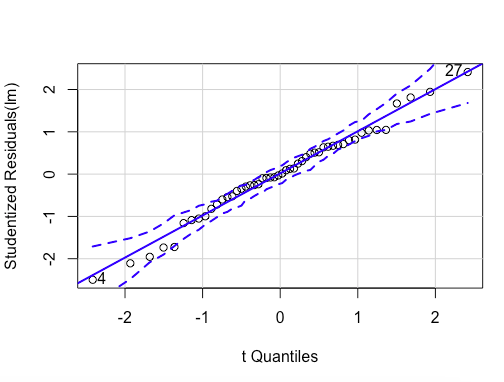
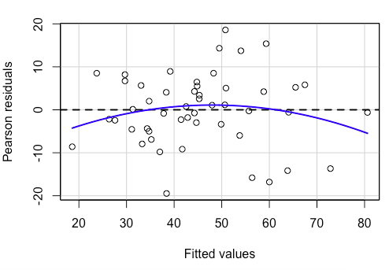
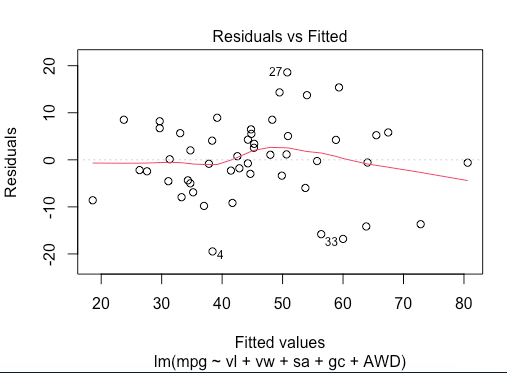
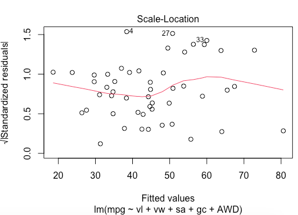
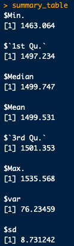

# Chrissy Cho's AutosRU-s

### Table of Contents
[ 1. Project Overview ](#desc)  
[ 2. Resources ](#resc)  
[ 3. Objectives ](#obj)  
[ 4. Challenge Overview ](#chal)  
[ 5. Challenge Objective ](#chalsum)  
[ 6. Results ](#find) 

## Project Overview
In this module, we've learned to supply statistics and hypothesis testing to analyze a series of datasets from the automotive industry. 

## Resources
- Data Source: [AutosRU's MechaCars Prototypes](https://github.com/chrissycho/AutosRU-s/blob/master/Challenge/MechaCar_mpg.csv), [MechaCars suspension coil](https://github.com/chrissycho/AutosRU-s/blob/master/Challenge/Suspension_Coil.csv)
- Software: R studio 1.1.463

## Objectives
- Load, clean up, and reshape datasets using tidyverse in R.
- Visualize datasets with basic plots such as line, bar, and scatter plots using ggplot2.
- Generate and interpret more complex plots such as boxplots and heatmaps using ggplot2.
- Plot and identify distribution characteristics of a given dataset.
- Formulate null and alternative hypothesis tests for a given data problem.
- Implement and evaluate simple linear regression and multiple linear regression models for a given dataset.
- Implement and evaluate the one-sample t-Tests, two-sample t-Tests, and analysis of variance (ANOVA) models for a given dataset.
- Implement and evaluate a chi-squared test for a given dataset.
- Identify key characteristics of A/B and A/A testing.
- Determine the most appropriate statistical test for a given hypothesis and dataset.

## Challenge Overview
In this challenge, we have to perform a series of statistical tests and create a technical report that provides interpretation of findings. 

## Challenge Objective
- Design and interpret a multiple linear regression analysis to identify variables of interest.
- Calculate summary statistics for quantitative variables.
- Perform a t-test in R and provide interpretation of results.
- Design your own statistical study to compare vehicle performance of two vehicles.

## Results
1. Design a multiple linear regression to predict the mpg of MechaCar prototypes using a number of variables (predictor) within the MechaCar mpg dataset.

- Both vehicle length and ground clearance provided a non-random amount of variance to the mpg values in the dataset. 
- The slope of the linear model is not 0 because we have significant results for certain predictors that account for variability observed in the dependent variabe. 
- This linear model predicts mpg of MechaCar prototypes effectively due to its p-value being less than 0.05 (p = 5.35e-11) and r^2 value is 0.68. 
- About 68% of the variance found in the mpg (dependent variable) can be explained by the predictors. 

Assumptions for multiple regressions checked
- Normality

- Linearity

- Homogeneity of Variance

2. Perform Suspension Coil T-Test

Statistical summary of suspension coil's pounds-per-inch variable

- The variance of the suspension coils do not exceed 100 punds per inch. Thus, the current manufacturing data meets this design specification.
- Perform one-sample t-test to determine if the suspension coil's pound-per-inch results are statistically different from the mean population results of 1,500 pounds-per-inch.
